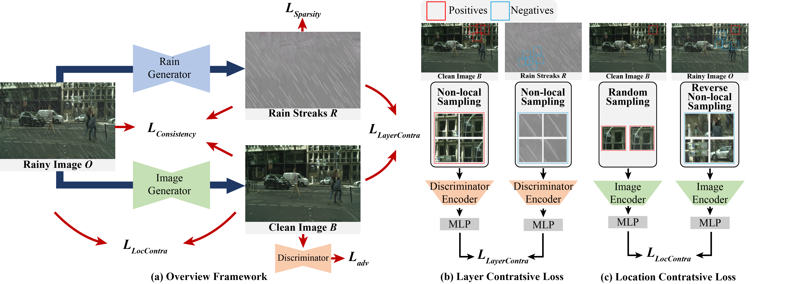

# Unsupervised Deraining Where Contrastive Learning Meets Self-similarity (CVPR 2022)
Yuntong Ye, Changfeng Yu, <a href='https://owuchangyuo.github.io/'>Yi Chang</a>, Lin Zhu, Xi-le Zhao, <a href='[https://owuchangyuo.github.io/](http://faculty.hust.edu.cn/yanluxin/zh_CN/)'>Luxin Yan</a>, Yonghong Tian

Paper link: [[Arxiv]](https://arxiv.org/abs/2203.11509) [[CVPR]](https://openaccess.thecvf.com/content/CVPR2022/html/Ye_Unsupervised_Deraining_Where_Contrastive_Learning_Meets_Self-Similarity_CVPR_2022_paper.html)

<hr>
<i>In this work, we propose a novel non-local contrastive learning (NLCL) method for unsupervised image deraining. Consequently, we not only utilize the intrinsic self-similarity property within samples, but also the mutually exclusive property between the two layers, so as to better differ the rain layer from the clean image. Specifically, the non-local self-similarity image layer patches as the positives are pulled together and similar rain layer patches as the negatives are pushed away. Thus the similar positive/negative samples that are close in the original space benefit us to enrich more discriminative representation. Apart from the self-similarity sampling strategy, we analyze how to choose an appropriate feature encoder in NLCL. Extensive experiments on different real rainy datasets demonstrate that the proposed method obtains state-of-the-art performance in deraining.</i>



## Package dependencies
The project is built with PyTorch 1.6.0, Python3.6. For package dependencies, you can install them by:
```bash
pip install -r requirements.txt
```
## Pretrained model
The pre-trained models of both Rain and Background Generator Network are provided in checkpoints/RealRain. 
## Training
To train NLCL on real rain dataset, you can begin the training by:
```train
python train.py --dataroot DATASET_ROOT --model NLCL --name NAME --dataset_mode unaligned
```
The DATASET_ROOT example are provided in datasets/RealRain.
## Evaluation
To evaluate NLCL, you can run:
```test
python test.py --dataroot DATASET_ROOT --model NLCL --name NAME --dataset_mode single --preprocess None
```
## Citation
If you find this project useful in your research, please consider citing:
```
@InProceedings{Ye_2022_CVPR,
    author    = {Ye, Yuntong and Yu, Changfeng and Chang, Yi and Zhu, Lin and Zhao, Xi-Le and Yan, Luxin and Tian, Yonghong},
    title     = {Unsupervised Deraining: Where Contrastive Learning Meets Self-Similarity},
    booktitle = {Proceedings of the IEEE/CVF Conference on Computer Vision and Pattern Recognition (CVPR)},
    month     = {June},
    year      = {2022},
    pages     = {5821-5830}
}
```
## Acknowledgement
This code is inspired by [CycleGAN](https://github.com/junyanz/pytorch-CycleGAN-and-pix2pix).
## Contact
Please contact us if there is any question or suggestion(Yun Guo guoyun@hust.edu.cn, Yuntong Ye yuntongye@hust.edu.cn, Yi Chang yichang@hust.edu.cn).
